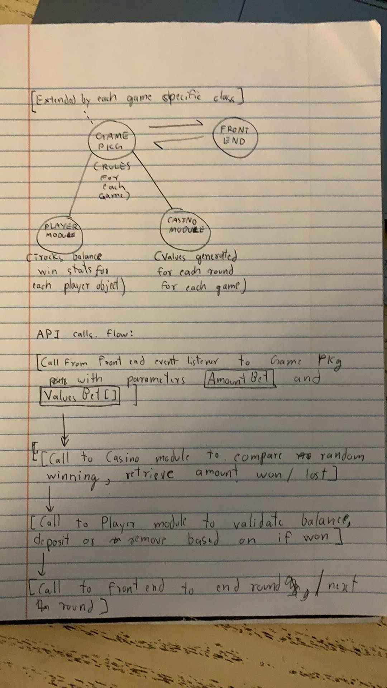

# Design Plan

## Members 
Jeff Kim (ek111)
Vincent Sinfuego (vjs12)
Aparimeya Taneja (at307)
Celine Murugi (cam160)

## Introduction
- Our team decided to build a software that can run multiple casino games. We wanted to make it easy to implement games within this program. We decided to use the MVC model, where the view will serve as the frontend that communicates with the user. View will take inputs from the user, which will be passed on to the controller, which parses the input in a specific format the model needs. Inputs will vary from the configuration of the game to the actual moves the user plays during a specific game. 
- We realized that the commonalities of all these casino game is the betting feature. By nature, the games we are trying to implement like roulette, blackjack, and slot machine will have significantly different  frontend unless we make multiple card games. However, the betting feature will be similar because each games will have multiple rounds where the user can bet a certain amount of money. 
- We were also thinking of implementing a common method of buying money, which could be universally used in different games within the program. 

## Overview
- This section serves as a map of your design for other programmers to gain a general understanding of how and why the program was divided up, and how the individual parts work together to provide the desired functionality. Describe specific modules you intend to create, their purpose with regards to the program's functionality, and how they collaborate with each other, focusing specifically on each one's API. Include a picture of how the modules are related (these pictures can be hand drawn and scanned in, created with a standard drawing program, or screen shots from a UML design program). Discuss specific classes, methods, and data structures, but not individual lines of code.
- As mentioned in our introduction, we will be following the MVC model where the view receives user input, which is handled by the controller, passed on to the model. The model will process the user input, which will be sent back to the controller and re-rendered in our view. This makes it easier to collaborate because we can modularize the software. 
- Some specific modules we thought of is the betting module, buying module, dealer module, player module, specific game modules, and others. Each of these modules are common functionalities among different games, and we will use these modules to implement each game. This will make it easier to implement new games as we can use existing modules rather than creating a completely new game 
- 

## Design Details
- This section describes each module introduced in the Overview in detail (as well as any other sub-modules that may be needed but are not significant to include in a high-level description of the program). Describe how each module's API handles specific features given in the assignment specification, what resources it might use, how it collaborates with other modules, and how each could be extended to include additional requirements (from the assignment specification or discussed by your team). Finally, justify the decision to create each module with respect to the design's key goals, principles, and abstractions.
- Player module: This module would be called upon when interacting with a game. The player module represents the actions and decisions of the user. There is also potential for multiple players to coexist in a game, including artificial intelligence, which is added functionality that may be implemented later if a more competitive game option were to be added. Similar to that of the dealer, visual resources such as a body or hands may enhance the feeling of presence in the game. Different types of players could be extended to handle different types of casino games. The player module will hold a betting sub-module and a buying sub-module.
- Casino module: All card games must have a neutral dealer party to reveal cards from a deck. All casino games have random numbers involved, and these random numbers mean different things in the context of each different game. Using imagery of a person or a dealer's hands may enhance the immersion of the game. In the event that multiple types of casino card games are implemented, even more casino functions may be required. 
- game module: Implementations of each game, winnings and logic. Games will have visuals and possibly audio to represent whatever is happening. The game will interact with the player and casino to send updates to the view.
- Betting sub-module: Betting tokens will be universal functionality for all casino games. This module will interact with the user's stock of tokens, which the player will need to bet in order to begin a game. It may use visual and/or auditory resources, but that is not of the highest importance. This module could potentially be extended to accommodate different games. For example, when playing slots, the amount of tokens bet will affect how the results are determined. For poker, there are multiple betting rounds per game. The betting module will be of utmost importance due to its necessity to be a part of each casino game.
- Buying sub-module: In order to gain tokens to spend at the casino, or to exchange said tokens for money, an exchange counter is necessary. Visual resources for the counter may be needed. This is a more simple and one-dimensional module, so it may end up as a standalone function. It is an important part of the project, however, due to the need to purchase tokens with money to fulfill the casino game fantasy.
- The key design goal here is to direct interactions between player and game, or player, dealer, and game. Then a separate interaction between exchanging money for tokens, then using said tokens to bet on games. These modules are all required to collaborate with one another to divy up specific duties within the program as a whole.

## Example games
1. Roulette : Roulette is a casino game named after the French word meaning little wheel. In the game, players may choose to place bets on either a single number, various groupings of numbers, the colors red or black, whether the number is odd or even, or if the numbers are high (19–36) or low (1–18). To determine the winning number, a java random function determines a value, one of 37 (single zero French/European style roulette) or 38 (double zero American style roulette). The winnings are then paid to the player if they have placed a successful bet.
2. Slots : Three values are randomised, with different values being more common than others. When certain combinations are made, certian rewards are given out. 
3. Blackjack : card game in which players try to acquire cards with a face value totalling 21 and no more. 

## Design Considerations
- This section describes any issues which need to be addressed or resolved before attempting to devise a complete design solution. Include any design decisions discussed at length (include pros and cons from all sides of the discussion) as well as any ambiguities, assumptions, or dependencies regarding the program that impact the overall de

- The main issue that needed to be addressed was coming up with the different modules in the backend and how they would all interact. We decided to have three main ones; the casino module, the game module, and the player module. The advantage of this approach is that each individual component takes charge of its own functionality, making them independent of each other. The game shall mildly act as the controller, with one of its key functions being its update
